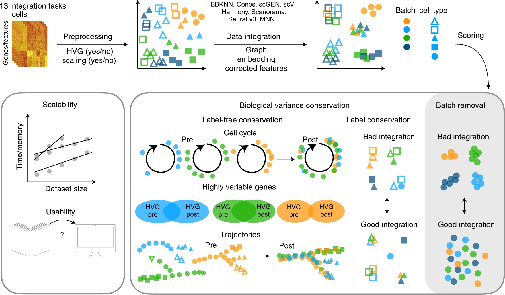
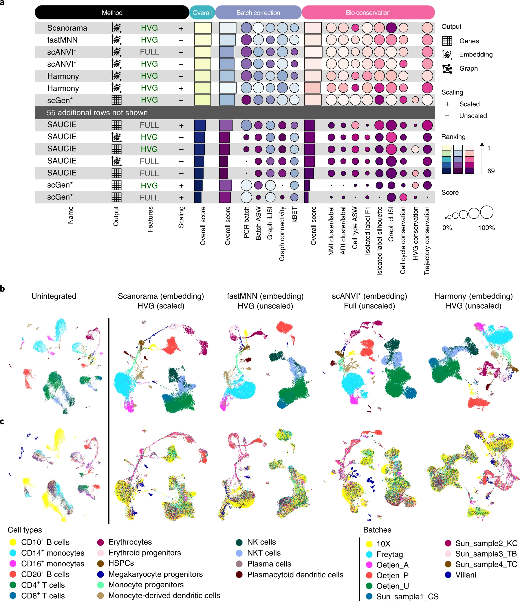

# SingleCell {#sgcell}

## Technology
### single cell

- scDNA
- scRNA
- scATAC

### spatial single cell

## Review

### Review-2021-06

[The triumphs and limitations of computational methods for scRNA-seq](https://www.nature.com/articles/s41592-021-01171-x)[@kharchenko2021triumphs]

Though computational approaches vary, most formulate (1) a statistical model of the measurement, (2) a representation of the data in reduced dimensions, and (3) an approximation of the expression manifold (Box 2), with a set of discrete transcriptional subpopulations being the simplest and the most common approximation. The problems motivating these steps, and the specific solutions and their assumptions, are the subject of this review.

[Key preprocessing steps in single-cell RNA-seq analysis](https://www.nature.com/articles/s41592-021-01171-x/figures/1)

[Key analysis steps in single-cell RNA-seq analysis](https://www.nature.com/articles/s41592-021-01171-x/figures/2)

**Box 1 Select software tools**
Tools for alignment, barcode correction, count matrix estimation, and quality control include:

- CellRanger (https://support.10xgenomics.com/single-cell-gene-expression/software/pipelines/latest/installation): supports 10x Chromium datasets (commercial product)

- dropEst (https://github.com/hms-dbmi/dropEst): supports multiple droplet-based protocols

- STAR (https://github.com/alexdobin/STAR): aligner (used internally by CellRanger and dropEst), also has built-in options for count matrix estimation

- Optimus (https://data.humancellatlas.org/pipelines/optimus-workflow): supports 10x Chromium v2 and v3 datasets, designed for Human Cell Atlas

- Kallisto/bustools (https://www.kallistobus.tools): fast processing using pseudoalignment

Cell filter and doublet identification tools include:

- EmptyDrops (https://rdrr.io/github/MarioniLab/DropletUtils/man/emptyDrops.html): uses a classifier to distinguish 'empty' cells that look like the low-end tail of the cell size distribution

- Scrublet (https://github.com/AllonKleinLab/scrublet): python-based, doublet simulation and doublet scoring

- doubletFinder (https://github.com/chris-mcginnis-ucsf/DoubletFinder): R-based, doublet simulation and doublet scoring

- scds (https://github.com/kostkalab/scds): fast doublet scoring implementation

Tools for normalization, dimensionality reduction, and clustering and differential expression include:

- Seurat (https://satijalab.org/seurat/): the most popular analysis toolkit, R-based

- scanpy (https://github.com/theislab/scanpy): the most popular python-based toolkit

- scVI (https://github.com/YosefLab/scVI): latent space identification using variational neural net

- pagoda2 (https://github.com/hms-dbmi/pagoda2): fast, R-based processing

- SAUCIE (https://www.krishnaswamylab.org/projects/saucie): a neural-net-based dimensionality reduction, using maximal mean discrepancy penalty

Tools for trajectory fitting include:

- Monocle3 (https://cole-trapnell-lab.github.io/monocle3/): third iteration of the Monocle package, including updated tree utilities

- Slingshot (https://github.com/kstreet13/slingshot): tree fitting with improved pseudotime estimation

- PAGA (https://github.com/theislab/paga): tree/graph fitting approach combined with cell aggregation, also supports cluster-based velocity estimates

- Wishbone (https://dpeerlab.github.io/dpeerlab-website/wishbone.html): a bifurcation analysis method

- Destiny, DPT (https://github.com/theislab/destiny/): dimensionality reduction and trajectory fitting using diffusion maps82

Tools for velocity estimation include:

- velocyto (http://velocyto.org/): reference python/R implementation

- scVelo (https://scvelo.readthedocs.io/): new implementation using curve-based phase portrait fit

#### Statistical view of a cell

#### Comparing transcriptional states

#### The quest for reduced dimensions

####

[scRNA-seq basics](https://www.nature.com/articles/s41592-021-01171-x/figures/3)

a, Beating Moore's law. The number of cells measured by landmark scRNA-seq datasets over years (red), compared with the increase in the CPU transistor counts (black). The set of all published scRNA-seq studies83 is shown with small red dots. The estimated number of cells in a human body is shown by a green dashed line. 
b, Shallow coverage of each cell can be compensated for by measuring more cells. The ability to distinguish two cell populations, assessed by the area under the receiver operating characteristic curve (ROC AUC) measure, is shown as a function of the number of measured cells (x axis) and the mean cell depth (y axis). Examples of three different simulations (1-3) within different parts of this design parameter space are shown on PCA projections. 
c, Probabilistic view of scRNA-seq estimates. Posterior probability of IL32 gene expression magnitude is shown for five cells from two different CD8+ T cell populations (red and blue, thin lines). Joint posteriors assessing the mean expression magnitude within each subpopulation are shown by thick dashed lines. 
d, Comparing CD4+ T cells and CD14+ monocytes, the plot shows the number (y axis, left) and the fraction (y axis, right) of the genes passing a 1% statistical significance threshold for differential expression (DE) as a function of the number of cells compared from each population (x axis). 
e, The scatter plot shows for each gene (dots) the mean (x axis) and variance (y axis) of the normalized UMI counts (CPM, counts per million) in CD4+ T cells. The Poisson expected value is shown in green, with a quadratic-based negative binomial fit shown in red. f-i, Variance normalization and most variable genes. 
f, A t-SNE embedding of a primary peripheral blood mononuclear cell (PBMC) dataset with cell annotations. NK, natural killer, separated into CD56 bright and dim subsets. pDC, plasmacytoid dendritic cell. 
g, Mean-variance relationship of different genes (dots) in the PBMC dataset is shown for log-transformed expression estimates. The genome-wide relationship, as captured by smoothed regression, is shown by the blue line. Genes whose variance is significantly higher than the genome-wide trend are shown as red dots. 
h, Residual variance is shown for the top 5,000 overdispersed genes, ordered by the statistical significance (x axis). 
i, Expression pattern of several example genes, with circles highlighting the subpopulations distinguished by the genes. 
j, Distribution of normalized expression magnitudes (CPM) for the CTSH gene across all CD14+ monocytes is shown on the linear scale (top) and after log transformation (bottom) with a pseudocount.

### Review-2021-07
[Computational principles and challenges in single-cell data integration](https://www.nature.com/articles/s41587-021-00895-7)[@argelaguet2021computational]

### Review-2021-10

[Over 1000 tools reveal trends in the single-cell RNA-seq analysis landscape](https://genomebiology.biomedcentral.com/articles/10.1186/s13059-021-02519-4)[@zappia2021over]

Single-cell gene expression measurements are cell type-specific (unlike DNA), more easily interpretable (compared to epigenetic modalities), and scalable to thousands of features (unlike antibody-based protein measurements) and thousands of cells. These features mean that scRNA-seq can be used as an anchor, often measured in parallel and used to link other modalities.

[The Awesome Single Cell repository](https://github.com/Rongtingting/awesome-single-cell) is a community-curated list of software packages, resources, researchers, and publications for various single-cell technologies and [Albert Villela's SingleCell Omics spreadsheet](https://docs.google.com/spreadsheets/d/1IPe2ozb1Mny8sLvJaSE57RJr3oruiBoSudAVhSH-O8M/edit?pli=1#gid=237186399)  tracks a range of information including technologies, companies, and software tools. 

The scRNA-tools database focuses specifically on the cataloging and manual curation of software tools for analyzing scRNA-seq data [23]. When tools become available (usually through a bioRxiv preprint), we classify them according to the analysis tasks they can be used for and record information such as associated preprints and publications, software licenses, code location, software repositories, and a short description. Most tools are added to the database within 30 days of the first preprint or publication (Additional file 1: Figure S1). All the recorded information is publicly available in an interactive format at https://www.scrna-tools.org/ [24]. As the number of tools in the database has moved past 1000, we have taken this opportunity to provide an update on the current state of the database and explore trends in scRNA-seq analysis across the past 5 years. We find that the focus of tool developers has moved on from continuous ordering of cells to methods for integrating samples and classifying cells. The database also shows us that more new tools are built using Python while the relative usage of R is declining. We also examine the role of open science in the development of the field and find that open source practices lead to increased citations. While the scRNA-tools database does not record every scRNA-seq analysis tool, the large proportion it does include over the history of what is still a young field make these analyses possible and a reasonable estimate of trends across all tools.

## Data processing

[Bayesian inference of gene expression states from single-cell RNA-seq data](https://www.nature.com/articles/s41587-021-00875-x)[@breda2021bayesian]

[summary of sanity approach](https://www.nature.com/articles/s41587-021-00875-x/figures/1)

## Clustering methods

## Benchmarking
[Benchmarking atlas-level data integration in single-cell genomics](https://www.nature.com/articles/s41592-021-01336-8)[@luecken2021benchmarking]

