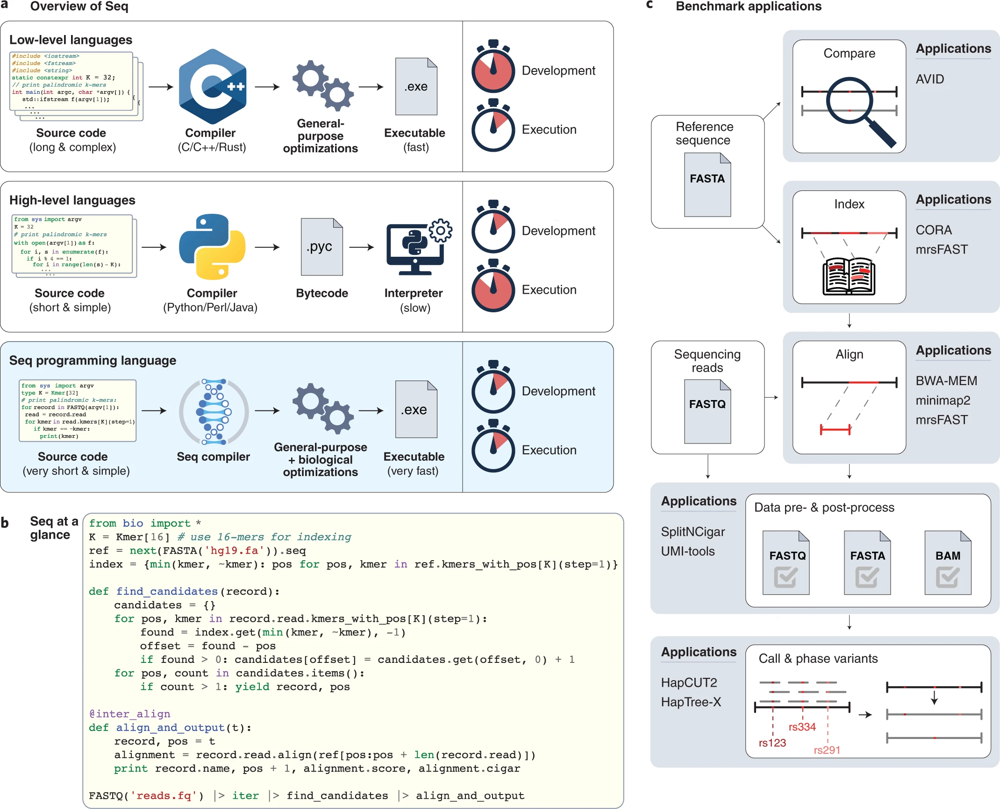

## languages and compilers
- Seq

[A Python-based programming language for high-performance computational genomics](https://www.nature.com/articles/s41587-021-00985-6)[@shajii2021python]

a, Conceptual comparison of Seq, Python and C++. Seq combines the high performance of C++ with the programming ease and clarity of Python, by virtue of domain-specific compiler optimizations that are hidden from the user. b, Example Seq code for a simple k-mer-based read mapper. c, Schematic of standard genomics pipeline and those state-of-the-art tools compared to Seq.

To demonstrate Seq's versatility, we reimplemented eight popular genomics tools in Seq, spanning key tasks in the genomics analysis pipeline (Fig. 1c and Supplementary Note 2), such as the finding of super-maximal exact matches, or SMEMs (BWA-MEM13), genome homology table construction (CORA14), Hamming distance-based all-mapping (mrsFAST15), long-read alignment (minimap216), **single-cell data preprocessing (UMI-tools17)**, SAM/BAM post-processing (GATK18), global sequence alignment (AVID19) and **haplotype phasing (Haptree-X20,21)**. 

[Hap Tree-X](https://github.com/seq-lang/seq-benchmarks/tree/master/seq-nbt#haptree-x-haplotype-phasing)

## singlecell analysis tools

- scanpy
[SCANPY: large-scale single-cell gene expression data analysis](https://genomebiology.biomedcentral.com/articles/10.1186/s13059-017-1382-0)

- seurat

## singlecell analysis sources

