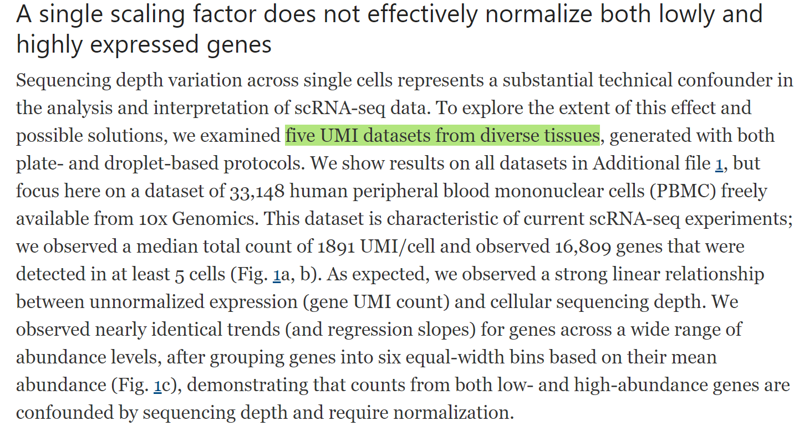
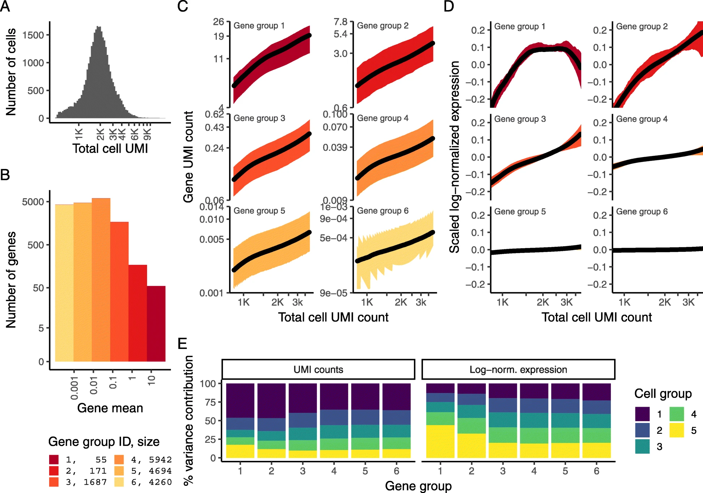

# Technology Related

## scRNA-seq

### NB models for scRNA-seq

DEseq2, scTransform, BASICS

#### DEseq2

[Moderated estimation of fold change and dispersion for RNA-seq data with DESeq2](https://genomebiology.biomedcentral.com/articles/10.1186/s13059-014-0550-8)[@love2014moderated]

**Shrinkage estimation of dispersion.** Plot of dispersion estimates over the average expression strength (A) for the Bottomly et al. [16] dataset with six samples across two groups and (B) for five samples from the Pickrell et al. [17] dataset, fitting only an intercept term. First, gene-wise MLEs are obtained using only the respective genes data (black dots). Then, a curve (red) is fit to the MLEs to capture the overall trend of dispersion-mean dependence. This fit is used as a prior mean for a second estimation round, which results in the final MAP estimates of dispersion (arrow heads). This can be understood as a shrinkage (along the blue arrows) of the noisy gene-wise estimates toward the consensus represented by the red line. The black points circled in blue are detected as dispersion outliers and not shrunk toward the prior (shrinkage would follow the dotted line). For clarity, only a subset of genes is shown, which is enriched for dispersion outliers. Additional file 1: Figure S1 displays the same data but with dispersions of all genes shown. MAP, maximum a posteriori; MLE, maximum-likelihood estimate.

#### scTransform

`Our procedure is broadly applicable for any UMI-based scRNA-seq dataset and is freely available to users through the open-source R package sctransform (github.com/ChristophH/sctransform), with a direct interface to our single-cell toolkit Seurat.`

`**Pearson residuals** from "regularized negative binomial regression," help remove the influence of technical characteristics from downstream analyses while preserving biological heterogeneity`

`unconstrained negative binomial model may overfit scRNA-seq data, and overcome this by pooling information across genes with similar abundances to obtain stable parameter estimates. `

[Normalization and variance stabilization of single-cell RNA-seq data using regularized negative binomial regression](https://genomebiology.biomedcentral.com/articles/10.1186/s13059-019-1874-1)[@hafemeister2019normalization]

https://github.com/ChristophH/sctransform/

We propose that the Pearson residuals from regularized negative binomial regression, where cellular sequencing depth is utilized as a covariate in a generalized linear model, successfully remove the influence of technical characteristics from downstream analyses while preserving biological heterogeneity.

- UMI-based scRNA-seq dataset

`observed **sequencing depth** (number of genes or molecules detected per cell) can vary significantly between cells, with variation in molecular counts potentially spanning an order of magnitude, even within the same cell type`

` while the now widespread use of unique molecular identifiers (UMI) in scRNA-seq removes technical variation associated with PCR, differences in cell lysis, reverse transcription efficiency, and stochastic molecular sampling during sequencing also contribute significantly, necessitating technical correction`

**Results**

- A single scaling factor does not effectively normalize both lowly and highly expressed genes

- Modeling single-cell data with a negative binomial distribution leads to overfitting

- Applying regularized negative binomial regression for single-cell normalization

- Pearson residuals effectively normalize technical differences, while retaining biological variation

- Downstream analytical tasks are not biased by sequencing depth

**Methods**

- Regularized negative binomial regression

#### BASiCS

[BASiCS: Bayesian Analysis of Single-Cell Sequencing Data](https://journals.plos.org/ploscompbiol/article?id=10.1371/journal.pcbi.1004333)[@vallejos2015basics]

KEY WORDS: **scRNA-seq counts**

## Hi-Seq

[Enhanced detection of minimal residual disease by targeted sequencing of phased variants in circulating tumor DNA](https://www.nature.com/articles/s41587-021-00981-w)[@Kurtz2021]

KEY WORDS: **phased variants**

