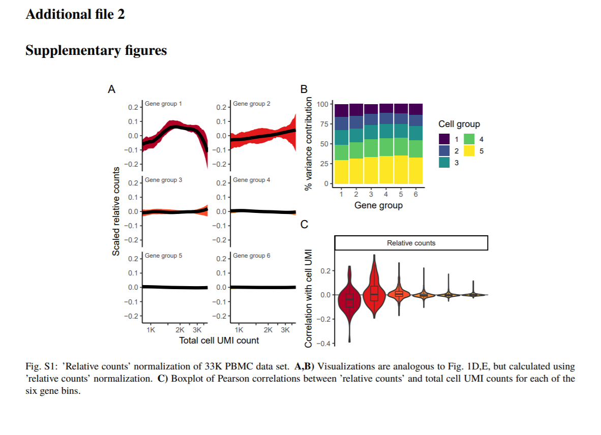

# Technology Related

## scRNA-seq modelling

### NB models for scRNA-seq

KEY WORDS: **scRNA-seq counts**

[TUTORIAL-High-Throughput Count Data](http://web.stanford.edu/class/bios221/book/Chap-CountData.html)

DEseq2, scTransform, BASICS

#### DEseq2

**[Moderated estimation of fold change and dispersion for RNA-seq data with DESeq2](https://genomebiology.biomedcentral.com/articles/10.1186/s13059-014-0550-8)[@love2014moderated]**

**Shrinkage estimation of dispersion.** Plot of dispersion estimates over the average expression strength (A) for the Bottomly et al. [16] dataset with six samples across two groups and (B) for five samples from the Pickrell et al. [17] dataset, fitting only an intercept term. First, gene-wise MLEs are obtained using only the respective genes data (black dots). Then, a curve (red) is fit to the MLEs to capture the overall trend of dispersion-mean dependence. This fit is used as a prior mean for a second estimation round, which results in the final MAP estimates of dispersion (arrow heads). This can be understood as a shrinkage (along the blue arrows) of the noisy gene-wise estimates toward the consensus represented by the red line. The black points circled in blue are detected as dispersion outliers and not shrunk toward the prior (shrinkage would follow the dotted line). For clarity, only a subset of genes is shown, which is enriched for dispersion outliers. Additional file 1: Figure S1 displays the same data but with dispersions of all genes shown. MAP, maximum a posteriori; MLE, maximum-likelihood estimate.

#### scTransform

`Our procedure is broadly applicable for any UMI-based scRNA-seq dataset and is freely available to users through the open-source R package sctransform (github.com/ChristophH/sctransform), with a direct interface to our single-cell toolkit Seurat.`

`**Pearson residuals** from "regularized negative binomial regression," help remove the influence of technical characteristics from downstream analyses while preserving biological heterogeneity`

`unconstrained negative binomial model may overfit scRNA-seq data, and overcome this by pooling information across genes with similar abundances to obtain stable parameter estimates. `

**[Normalization and variance stabilization of single-cell RNA-seq data using regularized negative binomial regression](https://genomebiology.biomedcentral.com/articles/10.1186/s13059-019-1874-1)[@hafemeister2019normalization]**

https://github.com/ChristophH/sctransform/

We propose that the Pearson residuals from regularized negative binomial regression, where cellular sequencing depth is utilized as a covariate in a generalized linear model, successfully remove the influence of technical characteristics from downstream analyses while preserving biological heterogeneity.

- UMI-based scRNA-seq dataset

`observed **sequencing depth** (number of genes or molecules detected per cell) can vary significantly between cells, with variation in molecular counts potentially spanning an order of magnitude, even within the same cell type`

` while the now widespread use of unique molecular identifiers (UMI) in scRNA-seq removes technical variation associated with PCR, differences in cell lysis, reverse transcription efficiency, and stochastic molecular sampling during sequencing also contribute significantly, necessitating technical correction`

**Results**

- A single scaling factor does not effectively normalize both lowly and highly expressed genes

- Modeling single-cell data with a negative binomial distribution leads to overfitting

- Applying regularized negative binomial regression for single-cell normalization

- Pearson residuals effectively normalize technical differences, while retaining biological variation

- Downstream analytical tasks are not biased by sequencing depth

**Methods**

- Regularized negative binomial regression

#### BASiCS

**[BASiCS: Bayesian Analysis of Single-Cell Sequencing Data](https://journals.plos.org/ploscompbiol/article?id=10.1371/journal.pcbi.1004333)[@vallejos2015basics]**

**INTRODUCTION**

- Cell_SPECIFIC NORMALIZATION

For instance, in Fig 1(a), each gene has the same expression rate in both cells, yet the expression counts in the first cell will be roughly twice as much as those from the second cell. In the same spirit, if different sequencing depths (the number of times a single nucleotide is read during the sequencing) are applied to these cells, the scale of expression counts will also be affected. Thus, normalisation is a crucial issue in this context. 

- gene specific variation

Another fundamental problem for interpreting single-cell sequencing is the presence of high levels of unexplained technical noise (unrelated to sequencing depth and other amplification biases) [5]. This creates new challenges for identifying genes that show genuine biological cell-to-cell heterogeneity-beyond that induced by technical variation-and motivates the systematic inclusion of spike-in genes in single-cell experiments

- UMI

Recently, the introduction of Unique Molecular Identifiers (UMI) attached to each cDNA molecule during reverse transcription has substantially reduced the levels of unexplained technical noise and eliminated the effect of sequencing depth changes and other amplification biases in single-cell experiments.

Nevertheless, our analysis of a mouse Embryonic Stem Cells (ESC) suggests that unexplained technical variability can not be completely removed by using UMIs (see Results section) and that an accurate quantification of technical variability still remains important.

**HIGHLIGHT**

In BASiCS (Bayesian Analysis of Single-Cell Sequencing data), a joint model of biological and spike-in genes is formulated to simultaneously quantify unexplained technical noise and cell-to-cell biological heterogeneity using the complete set of data, borrowing information between both sets of genes (spike-in and biological) through common parameters in a hierarchical structure. Additionally, BASiCS incorporates an automated normalisation method, where normalising constants are treated as model parameters.

#### edgeR

**[edgeR: a Bioconductor package for differential expression analysis of digital gene expression data](https://www.ncbi.nlm.nih.gov/pmc/articles/PMC2796818/)[@robinson2010edger]**

**[Differential expression analysis of multifactor RNA-Seq experiments with respect to biological variation](https://www.ncbi.nlm.nih.gov/pmc/articles/PMC3378882/)[@mccarthy2012differential]**

#### Sanity

**[Bayesian inference of gene expression states from single-cell RNA-seq data](https://www.nature.com/articles/s41587-021-00875-x)[@breda2021bayesian]**

### Batch-effect correction methods for scRNA-seq

**[A benchmark of batch-effect correction methods for single-cell RNA sequencing data](https://link.springer.com/article/10.1186/s13059-019-1850-9)[@tran2020benchmark]**

- Abstract
**Background**: Large-scale single-cell transcriptomic datasets generated using different technologies contain batchspecific
systematic variations that present a challenge to batch-effect removal and data integration. With continued
growth expected in scRNA-seq data, achieving effective batch integration with available computational resources is
crucial. Here, we perform an in-depth benchmark study on available batch correction methods to determine the
most suitable method for batch-effect removal.

**Results**: We compare 14 methods in terms of computational runtime, the ability to handle large datasets, and
batch-effect correction efficacy while preserving cell type purity. Five scenarios are designed for the study: identical
cell types with different technologies, non-identical cell types, multiple batches, big data, and simulated data.
Performance is evaluated using four benchmarking metrics including kBET, LISI, ASW, and ARI. We also investigate
the use of batch-corrected data to study differential gene expression.

**Conclusion**: Based on our results, Harmony, LIGER, and Seurat 3 are the recommended methods for batch
integration. Due to its significantly shorter runtime, Harmony is recommended as the first method to try, with the
other methods as viable alternatives.

**Keywords**: Single-cell RNA-seq, Batch correction, Batch effect, Integration, Differential gene expression

## Hi-Seq

**[Enhanced detection of minimal residual disease by targeted sequencing of phased variants in circulating tumor DNA](https://www.nature.com/articles/s41587-021-00981-w)[@Kurtz2021]**

KEY WORDS: **phased variants**

