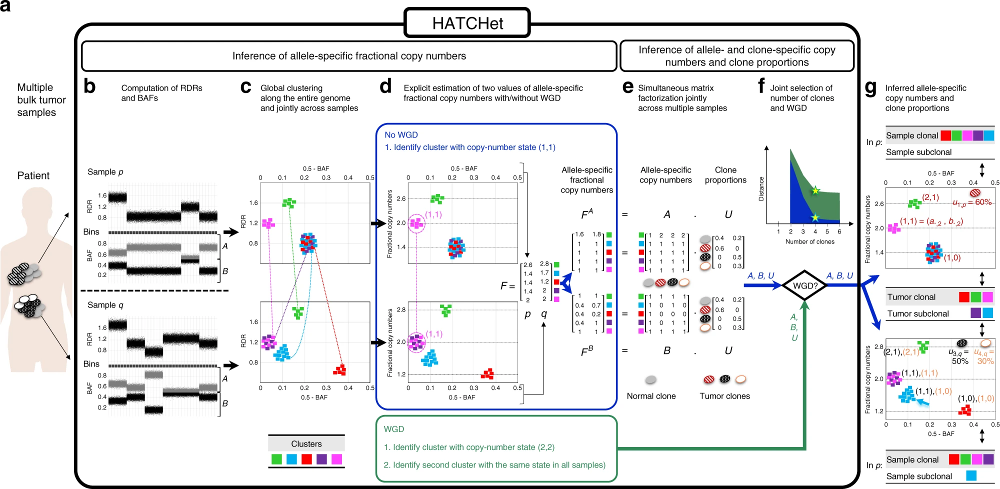
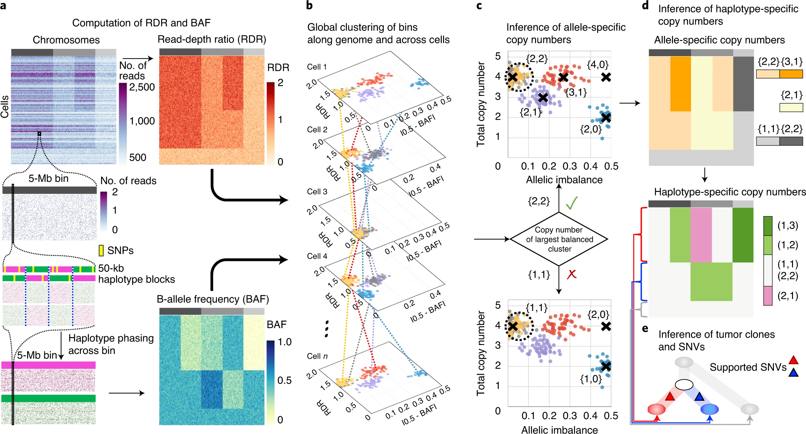
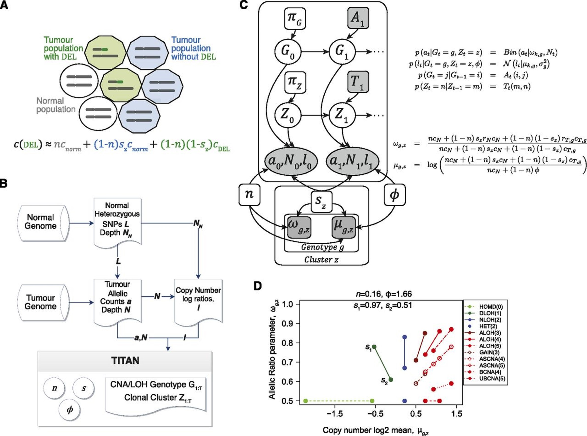
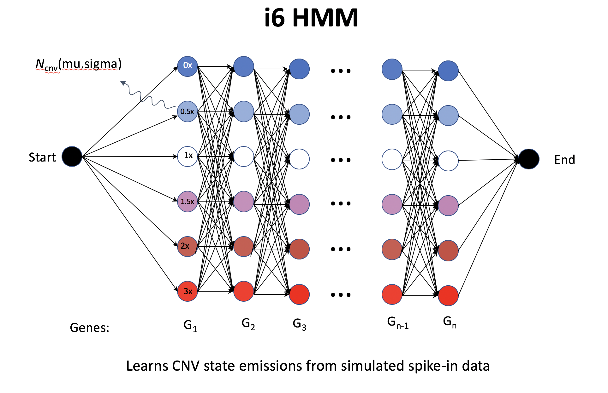
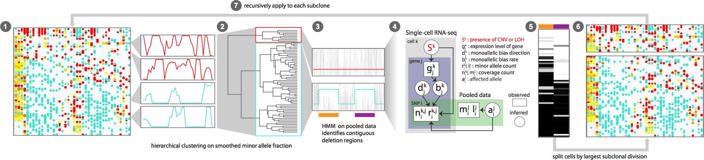
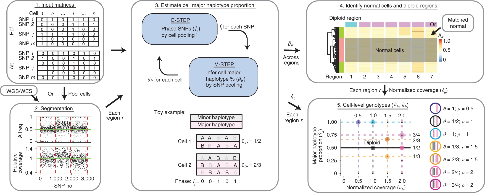
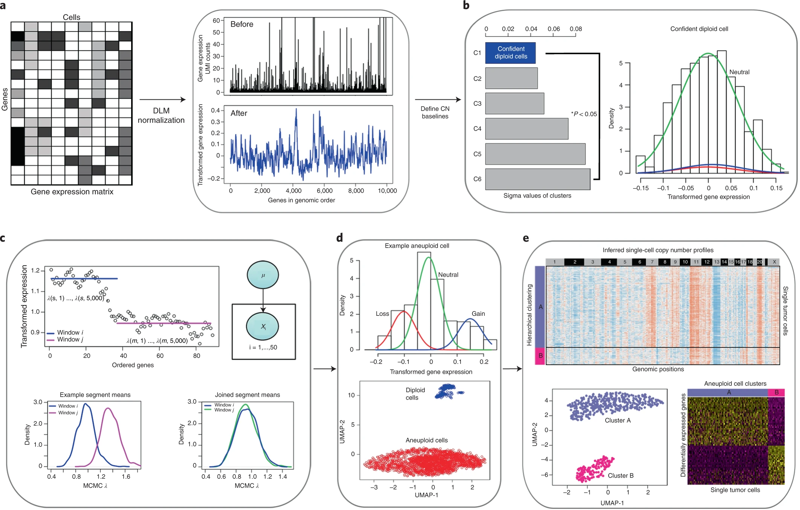
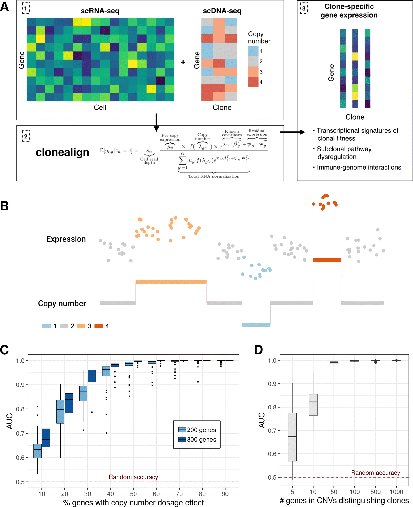

# Research topic based

## CNV calling

### breaking point detection
- 4 CNV breakpoint detection methods (2021-07-17 Group meeting)

1. CHISEL: https://www.nature.com/articles/s41587-020-0661-6#Sec8 (see global clustering subsection)
 - seemingly no breakpoint detection, but rather a global clustering (ie. entry-wise for a bin-by-cell matrix), thus the resolution of CNV is the bin size (5MB)
2. Alleloscope:  https://www.nature.com/articles/s41587-021-00911-w#Sec10 (see segmentation subsection)
 - HMM on a pooled cells (pseudo-bulk?) with pre-defined Gaussian means and variance for each state
3. InferCNV: https://github.com/broadinstitute/inferCNV/wiki/inferCNV-HMM-based-CNV-Prediction-Methods
 - i6-HMM generates in silico spike-in; seemingly define CNV region (segment) on cluster instead of cell, but using noise model on each cell (not quite sure from the doc).
4. CopyKat: https://www.nature.com/articles/s41587-020-00795-2#Sec9
 - KS test for whether to two neighbour bins should be joined, by using the posterior samples of Gamma-Poisson posterior. Seemingly using noise model on each cell within a cluster

FACLON
https://academic.oup.com/nar/article/43/4/e23/2410993

 https://www.nature.com/articles/s41467-020-17967-y/figures/1
 
 **a** HATCHet takes in input DNA sequencing data from multiple bulk tumor samples of the same patient and has five steps. 
 **b** First, HATCHet calculates the RDRs and BAFs in bins of the reference genome (black squares). Here, we show two tumor samples p and q. 
 **c** Second, HATCHet clusters the bins based on RDRs and BAFs globally along the entire genome and jointly across samples p and q. Each cluster (color) includes bins with the same copy-number state within each clone present in p or q. 
 **d** Third, HATCHet estimates two values for the fractional copy number of each cluster by scaling RDRs. If there is no WGD, the identification of the cluster (magenta) with copy-number state (1, 1) is sufficient and RDRs are scaled correspondingly. 
 If a WGD occurs, HATCHet identifies an additional cluster with identical copy-number state in all tumor clones. Dashed black horizontal lines in the scaled BAF-RDR plot represent values of fractional copy numbers that correspond to clonal CNAs. 
 **e** Fourth, HATCHet factors the allele-specific fractional copy numbers FA, FB into the allele-specific copy numbers A, B, respectively, and the clone proportions U. Here, there is a normal clone and 3 tumor clones. 
 **f** Last, HATCHet’s model-selection criterion identifies the matrices A, B, and U in the factorization while evaluating the fit according to both the inferred number of clones and presence/absence of a WGD. 
 **g** HATCHet outputs allele- and clone-specific copy numbers (with the color of the corresponding clone) and clone proportions (in the top right part of each plot) for each sample. 
 Clusters are classified according to the inference of unique/different copy-number states in each sample (sample-clonal/subclonal) and across all tumor clones (tumor-clonal/subclonal).

https://www.nature.com/articles/s41587-020-0661-6/figures/1

**a**, CHISEL computes RDRs and BAFs in low-coverage (<0.05× per cell) single-cell DNA sequencing data (top left). Read counts from 2,000 individual cells (rows) in 5-Mb genomic bins (columns) across three chromosomes (gray rectangles in first row) are shown. 
For each bin in each cell, CHISEL computes the RDR (top) by normalizing the observed read counts. CHISEL computes the BAF in each bin and cell (bottom) by first performing referenced-based phasing of germline SNPs in 50-kb haplotype blocks (magenta and green) and then phasing all these blocks jointly across all cells. 
**b**, CHISEL clusters RDRs and BAFs globally along the genome and jointly across all cells resulting here in five clusters of genomic bins (red, blue, purple, yellow and gray) with distinct copy-number states. 
**c**, CHISEL infers a pair {c^t,cˇt} of allele-specific copy numbers for each cluster by determining whether the allele-specific copy numbers of the largest balanced (BAF of ~0.5) cluster are equal to {1, 1} (diploid), {2, 2} (tetraploid) or are higher ploidy. 
**d**, CHISEL infers haplotype-specific copy numbers (at, bt) by phasing the allele-specific copy numbers {c^t,cˇt} consistently across all cells. 
**e**, CHISEL clusters tumor cells into clones according to their haplotype-specific copy numbers. Here, a diploid clone (light gray) and two tumor clones (red and blue) are obtained. 
A phylogenetic tree describes the evolution of these clones. Somatic SNVs are derived from pseudo-bulk samples and placed on the branches of the tree.

### Related research

**clonealign**: statistical integration of independent single-cell RNA and DNA sequencing data from human cancers

However, independently sampled single-cell measurements introduce a new analytical challenge of how to associate cells across each modality. Assuming a population structure with a fixed number of clones, this can be expressed as a mapping problem, whereby cells measured with transcriptome assays must be aligned to those measured with a genome assay.

 In order to relate the independent measurements, we assume that an increase in the copy number of a gene will result in a corresponding increase in that gene's expression and vice versa (Fig. 1b)
 a relationship previously observed in joint RNA-DNA assays in bulk tissues [12] and at the single-cell level [9, 10, 13].

**CHISEL**

**inferCNV**

**copyKAT**

**CaSpER**

**HoneyBADGER**

### PUBMON
[Precise identification of cancer cells from allelic imbalances in single cell transcriptomes](https://www.biorxiv.org/content/10.1101/2021.11.25.469995v1)

this paper used BAF information to identify cancer cells, seems quite relevant.

