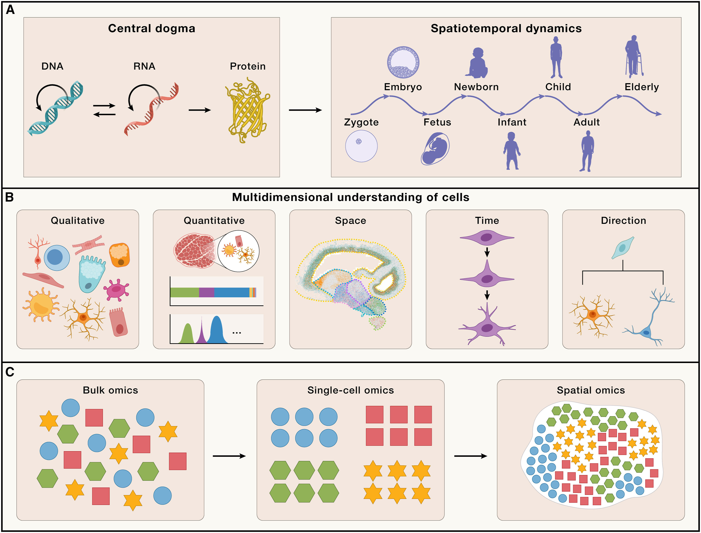
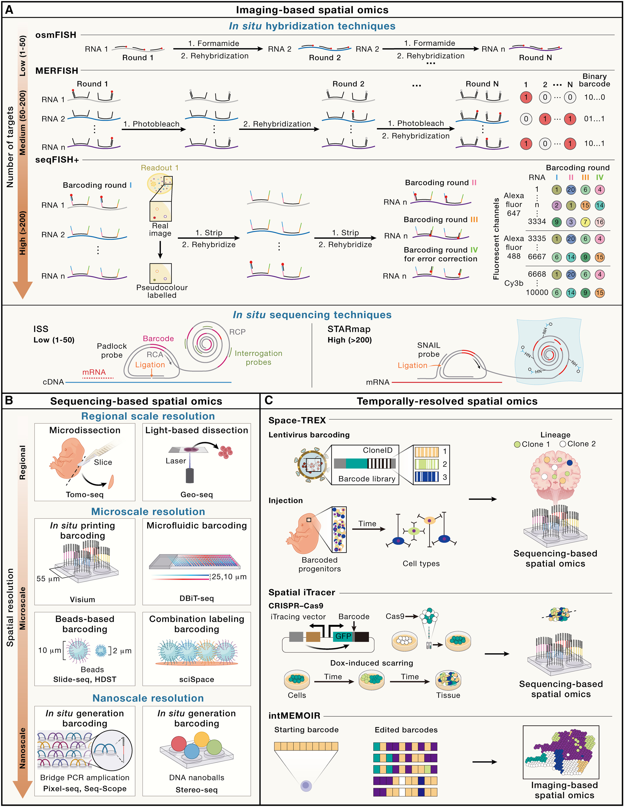

## Spatial transcriptomics

- 202109 Read in depth (lead by xianjie)

**[The spatial landscape of clonal somatic mutations in benign and malignant tissue](https://www.biorxiv.org/content/10.1101/2021.07.12.452018v1.full)[@erickson2021spatial]**

Keywords: CNV

**[Multimodal analysis of composition and spatial architecture in human squamous cell carcinoma](https://www.sciencedirect.com/science/article/pii/S0092867420306723)[@zhang2021supergnova]**

Keywords: alignment of scRNA AND ST

- 2022 spatial and CNV

**[Statistical and machine learning methods for spatially resolved transcriptomics data analysis](https://genomebiology.biomedcentral.com/articles/10.1186/s13059-022-02653-7)[@zeng2022statistical]**

**[STARCH: copy number and clone inference from spatial transcriptomics data](https://pubmed.ncbi.nlm.nih.gov/33022659/)[@elyanow2021starch]**

**[The spatial landscape of clonal somatic mutations in benign and malignant tissue](https://www.biorxiv.org/content/10.1101/2021.07.12.452018v1.abstract)[@erickson2021spatial]**

Keywords: spatial; CNV

- 202409 Review

**[Spatiotemporal omics for biology and medicine](https://www.cell.com/cell/fulltext/S0092-8674(24)00834-1)[@liu2024spatiotemporal]**

Keywords: spatial tech

This review offers an updated overview of how spatial omics has advanced our understanding of **the translation of genetic information into cellular heterogeneity and tissue structural organization and their dynamic changes over time**. It emphasizes the discovery of various biological phenomena, related to organ functionality, embryogenesis, species evolution, and the pathogenesis of diseases.

**However, a critical question remains about how these variants influence the functions of specific organs or cells.** 
Addressing these challenges necessitates a comprehensive understanding of how molecular-level sequence information translates to a single cell within a network of communicating and interacting cells that form functional biological systems. **This encompasses (1) qualitative-the diversity of cell types generated through the regulation of gene expression; (2) quantitative-the count, proportion, and density of each cell type; (3) space-the spatial arrangement of each cell type and their interactions and cellular ecosystem; (4) time-the specific timing of changes in cell types and states; and (5) direction-the potential transformational paths each cell type may undergo (Figure 1B).**

Understanding these **multifaceted dimensions of cellular diversity and organization** is crucial for comprehending the connections between the genome and specific biological processes, as well as the regulatory mechanisms involved.

The advances of sequencing technologies, particularly the massively parallel sequencing technology, has enabled large-scale, genome-wide multi-omics analyses of tissues. These methods have revealed pronounced tissue and cell specificity in genetic transcription. However, multi-omics analyses based on bulk tissue primarily capture average-level signals, failing to fully comprehend the heterogeneity of different cell types within tissues. The emergence of single-cell sequencing technology in 2009, and its rapid development in terms of throughput, cost, and multimodal capabilities, has provided unprecedented tools for understanding the cellular heterogeneity within tissues. Currently, single-cell omics enables the definition of cell types and states across multiple dimensions, including genomic, transcriptomic, epigenomic, and proteomic profiles. This has become a crucial technological means for answering how genomic information is transcribed and channeled into specific cell-type information. However, it remains challenging to get a good representation of all tissue-resident cell types and cell states. **In particular, the capture of rare cells requires a large number of analyzed cells (unbiased) or cell-selection (biased) approaches to reach the level of statistical power to compare between cell types. Furthermore, the specific spatial context of cells within tissues, forming organs with distinct functions, poses additional complexity.** Traditional imaging methods, such as X-rays, computed tomography (CT) scans, and magnetic resonance imaging (MRI) scans, have enabled visualization of the three-dimensional (3D) structure of tissues and organs but lack molecular and cellular resolution. Immunohistochemistry (IHC) or in situ hybridization (ISH) allow for spatial localization of specific genes or proteins but can only detect a limited number of targets. Recent developments in spatial omics technologies address these limitations by providing solutions for acquiring high content omics data on tissues while retaining spatial localization information. **Spatial omics technologies enable comprehensive mapping of cellular composition, localization, cell-cell interactions, and spatial dynamics of cellular ecosystems (Figure 1C). From a functional perspective, these variables are essential for understanding morphogenesis during development, the structure of different organs, and their subsequent functionality and cellular microenvironment changes associated with disease processes.**

###  An overview of spatial omics methods
The fundamental essence of spatial omics technology lies in its aptitude for the simultaneous detection of molecular constituents at exact spatial coordinates. **Predominant technological advances encompass methodologies reliant on either imaging-based detection or indirect interrogation through massively parallel sequencing. **  The former, an advanced derivative of single-molecule hybridization techniques, provides a high degree of resolution, transitioning the scope of gene detection from single-gene analysis toward the simultaneous quantification of hundreds to thousands of pre-selected gene targets. In contrast, the latter, inherently capable of unbiased whole-genome analysis, has witnessed a progressive refinement in its precision, advancing from regional to cellular and ultimately to subcellular resolution.

