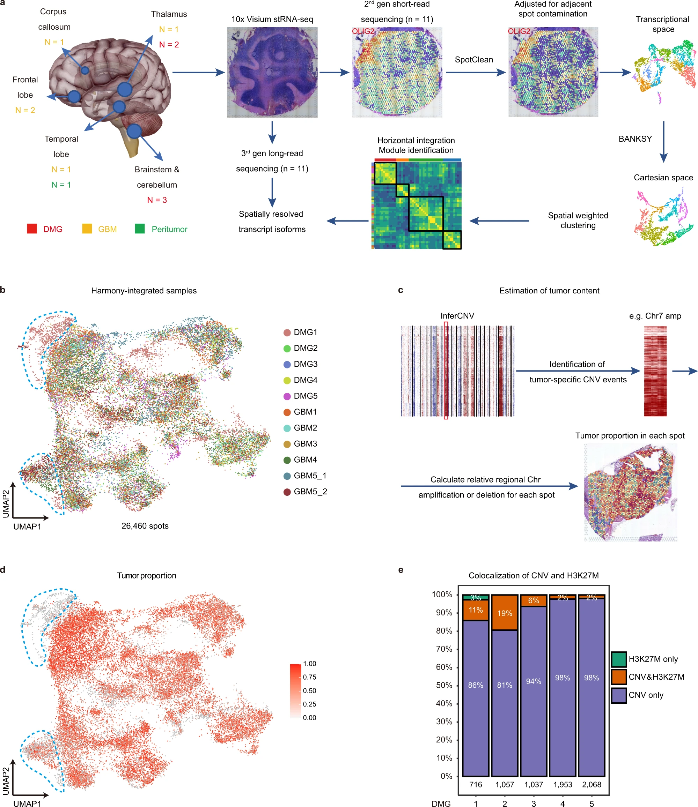

## Spatial transcriptomics Methods

-   Readinglist

[Systematic comparison of sequencing-based spatial transcriptomic methods](https://www.nature.com/articles/s41592-024-02325-3)

## Spatial Datasets Collection

-   CNA focused exploration

1.  DMG+GBM Dataset

[Spatial transcriptomics reveals niche-specific enrichment and vulnerabilities of radial glial stem-like cells in malignant gliomas](https://www.nature.com/articles/s41467-023-36707-6)

Diffuse midline glioma-H3K27M mutant (DMG) and glioblastoma (GBM) are the most lethal brain tumors that primarily occur in pediatric and adult patients, respectively. Both tumors exhibit significant heterogeneity, shaped by distinct genetic/epigenetic drivers, transcriptional programs including RNA splicing, and microenvironmental cues in glioma niches. However, the spatial organization of cellular states and niche-specific regulatory programs remain to be investigated. Here, we perform a spatial profiling of DMG and GBM combining short- and long-read spatial transcriptomics, and single-cell transcriptomic datasets. We identify clinically relevant transcriptional programs, RNA isoform diversity, and multi-cellular ecosystems across different glioma niches. We find that while the tumor core enriches for oligodendrocyte precursor-like cells, radial glial stem-like (RG-like) cells are enriched in the neuron-rich invasive niche in both DMG and GBM. Further, we identify niche-specific regulatory programs for RG-like cells, and functionally confirm that FAM20C mediates invasive growth of RG-like cells in a neuron-rich microenvironment in a human neural stem cell derived orthotopic DMG model. Together, our results provide a blueprint for understanding the spatial architecture and niche-specific vulnerabilities of DMG and GBM[@ren2023spatial].

[data request](https://ngdc.cncb.ac.cn/gsa-human/browse/HRA001865)

2.  GBM_ST

[Spatially resolved multi-omics deciphers bidirectional tumor-host interdependence in glioblastoma](https://www.sciencedirect.com/science/article/pii/S1535610822002203?ref=pdf_download&fr=RR-2&rr=82a4735d0c8f20e1)

**Summary**
Glioblastomas are malignant tumors of the central nervous system hallmarked by subclonal diversity and dynamic adaptation amid developmental hierarchies. The source of dynamic reorganization within the spatial context of these tumors remains elusive. Here, we characterized glioblastomas by spatially resolved transcriptomics, metabolomics, and proteomics. By deciphering regionally shared transcriptional programs across patients, we infer that glioblastoma is organized by spatial segregation of lineage states and adapts to inflammatory and/or metabolic stimuli, reminiscent of the reactive transformation in mature astrocytes. Integration of metabolic imaging and imaging mass cytometry uncovered locoregional tumor-host interdependence, resulting in spatially exclusive adaptive transcriptional programs. Inferring copy-number alterations emphasizes a spatially cohesive organization of subclones associated with reactive transcriptional programs, confirming that environmental stress gives rise to selection pressure. A model of glioblastoma stem cells implanted into human and rodent neocortical tissue mimicking various environments confirmed that transcriptional states originate from dynamic adaptation to various environments[@ravi2022spatially].

**Highlights** 

- Five spatially distinct transcriptional programs are identified in glioblastomas

-   Hypoxia induces defined transcriptional and genomic responses, including CNAs

-   Immunosuppressive tumor-myeloid cell interactions are enhanced in segregated niches

-   Non-stress environments support subtype transition towards developmental stages

3.  GBM_Multilayer

[Integrative spatial analysis reveals a multi-layered organization of glioblastoma](https://www.cell.com/cell/fulltext/S0092-8674(24)00320-9?_returnURL=https%3A%2F%2Flinkinghub.elsevier.com%2Fretrieve%2Fpii%2FS0092867424003209%3Fshowall%3Dtrue)

**Abstract**

Glioma contains malignant cells in diverse states. Here, we combine spatial transcriptomics, spatial proteomics, and computational approaches to define glioma cellular states and uncover their organization. We find three prominent modes of organization. First, gliomas are composed of small local environments, each typically enriched with one major cellular state. Second, specific pairs of states preferentially reside in proximity across multiple scales. This pairing of states is consistent across tumors. Third, these pairwise interactions collectively define a global architecture composed of five layers. Hypoxia appears to drive the layers, as it is associated with a long-range organization that includes all cancer cell states. Accordingly, tumor regions distant from any hypoxic/necrotic foci and tumors that lack hypoxia such as low-grade IDH-mutant glioma are less organized. In summary, we provide a conceptual framework for the organization of cellular states in glioma, highlighting hypoxia as a long-range tissue organizer.[@greenwald2024integrative]

Keywords: glioblastoma; glioma; hypoxia; intratumor heterogeneity; spatial proteomics; spatial transcriptomics.

4.  Liver 

[Comprehensive analysis of spatial architecture in primary liver cancer](https://www.science.org/doi/10.1126/sciadv.abg3750)

Heterogeneity is the major challenge for cancer prevention and therapy. Here, we first constructed high-resolution spatial transcriptomes of primary liver cancers (PLCs) containing 84,823 spots within 21 tissues from seven patients. The progressive comparison of spatial tumor microenvironment (TME) characteristics from nontumor to leading-edge to tumor regions revealed that the tumor capsule potentially affects intratumor spatial cluster continuity, transcriptome diversity, and immune cell infiltration. Locally, we found that the bidirectional ligand-receptor interactions at the 100-??m-wide cluster-cluster boundary contribute to maintaining intratumor architecture and the PROM1+ and CD47+ cancer stem cell niches are related to TME remodeling and tumor metastasis. Last, we proposed a TLS-50 signature to accurately locate tertiary lymphoid structures (TLSs) spatially and unveiled that the distinct composition of TLSs is shaped by their distance to tumor cells. Our study provides previous unknown insights into the diverse tumor ecosystem of PLCs and has potential benefits for cancer intervention.[@wu2021comprehensive]

[data request](https://ngdc.cncb.ac.cn/gsa-human/browse/HRA000437)

5.  NPC

[Nasopharyngeal carcinoma cells promote regulatory T cell development and suppressive activity via CD70-CD27 interaction](https://www.nature.com/articles/s41467-023-37614-6)

**Abstract**
Despite the intense CD8+ T-cell infiltration in the tumor microenvironment of nasopharyngeal carcinoma, anti-PD-1 immunotherapy shows an unsatisfactory response rate in clinical trials, hindered by immunosuppressive signals. To understand how microenvironmental characteristics alter immune homeostasis and limit immunotherapy efficacy in nasopharyngeal carcinoma, here we establish a multi-center single-cell cohort based on public data, containing 357,206 cells from 50 patient samples. We reveal that nasopharyngeal carcinoma cells enhance development and suppressive activity of regulatory T cells via CD70-CD27 interaction. CD70 blocking reverts Treg-mediated suppression and thus reinvigorate CD8+ T-cell immunity. Anti-CD70+ anti-PD-1 therapy is evaluated in xenograft-derived organoids and humanized mice, exhibiting an improved tumor-killing efficacy. Mechanistically, CD70 knockout inhibits a collective lipid signaling network in CD4+ naive and regulatory T cells involving mitochondrial integrity, cholesterol homeostasis, and fatty acid metabolism. Furthermore, ATAC-Seq delineates that CD70 is transcriptionally upregulated by NFKB2 via an Epstein-Barr virus-dependent epigenetic modification. Our findings identify CD70+ nasopharyngeal carcinoma cells as a metabolic switch that enforces the lipid-driven development, functional specialization and homeostasis of Tregs, leading to immune evasion. This study also demonstrates that CD70 blockade can act synergistically with anti-PD-1 treatment to reinvigorate T-cell immunity against nasopharyngeal carcinoma [@gong2023nasopharyngeal].

6.  Prostate

[Spatially resolved clonal copy number alterations in benign and malignant tissue](https://www.nature.com/articles/s41586-022-05023-2)

Defining the transition from benign to malignant tissue is fundamental to improving early diagnosis of cancer1. Here we use a systematic approach to study spatial genome integrity in situ and describe previously unidentified clonal relationships. We used spatially resolved transcriptomics2 to infer spatial copy number variations in >120,000 regions across multiple organs, in benign and malignant tissues. We demonstrate that genome-wide copy number variation reveals distinct clonal patterns within tumours and in nearby benign tissue using an organ-wide approach focused on the prostate. Our results suggest a model for how genomic instability arises in histologically benign tissue that may represent early events in cancer evolution. We highlight the power of capturing the molecular and spatial continuums in a tissue context and challenge the rationale for treatment paradigms, including focal therapy.[@erickson2022spatially]

7.  Skin

[Multimodal Analysis of Composition and Spatial Architecture in Human Squamous Cell Carcinoma](https://www.cell.com/cell/fulltext/S0092-8674(20)30672-3?_returnURL=https%3A%2F%2Flinkinghub.elsevier.com%2Fretrieve%2Fpii%2FS0092867420306723%3Fshowall%3Dtrue)

**Highlights**

- Profiling of 10 human skin SCCs and matched normals via scRNA-seq, ST, and MIBI

- Tumor-specific keratinocytes (TSKs) reside within a fibrovascular niche at leading edges

- Distinct ligand-receptor and spatial niche associations for tumor and stromal cells.

- Subpopulation essential tumorigenic gene networks defined by in vivo CRISPR screening

**Summary**
To define the cellular composition and architecture of cutaneous squamous cell carcinoma (cSCC), we combined single-cell RNA sequencing with spatial transcriptomics and multiplexed ion beam imaging from a series of human cSCCs and matched normal skin. cSCC exhibited four tumor subpopulations, three recapitulating normal epidermal states, and a tumor-specific keratinocyte (TSK) population unique to cancer, which localized to a fibrovascular niche. Integration of single-cell and spatial data mapped ligand-receptor networks to specific cell types, revealing TSK cells as a hub for intercellular communication. Multiple features of potential immunosuppression were observed, including T regulatory cell (Treg) co-localization with CD8 T cells in compartmentalized tumor stroma. Finally, single-cell characterization of human tumor xenografts and in vivo CRISPR screens identified essential roles for specific tumor subpopulation-enriched gene networks in tumorigenesis. These data define cSCC tumor and stromal cell subpopulations, the spatial niches where they interact, and the communicating gene networks that they engage in cancer[@ji2020multimodal].
