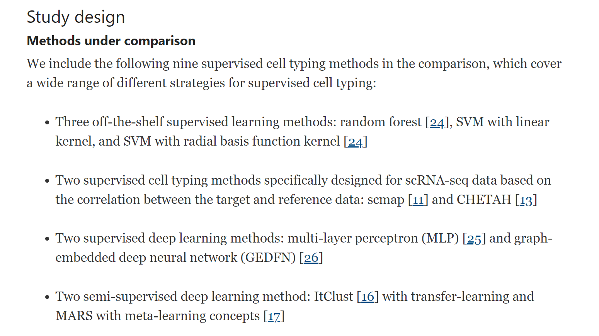
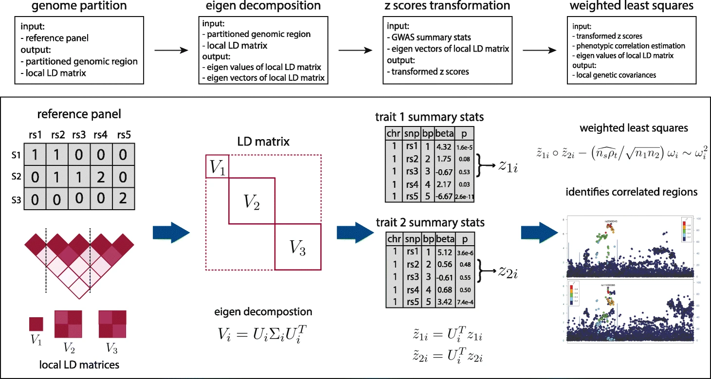

# Pubmon
## 2020-2021 PhD year 1

-202009

-202010

-202011

-202012

-202101

-202102

-202103

-202104

-202105

-202106

-202107

-202108

[Refer to pubmon record](https://hlab-pubmon.readthedocs.io/en/latest/)

## 2021-2022 PhD year 2

The cell-level resolution data provide much richer information for answering a number of important questions that cannot otherwise be answered by bulk data, for example, the composition of cell types in complex tissues, the cell-to-cell heterogeneity in transcription, and the transcriptional dynamics in many biological processes such as development, differentiation, and disease progression.

There are several scientific goals in scRNA-seq studies. The first one is to decipher the cellular composition of complex tissues: one wants to know the identities of the cell types and subtypes, as well as their proportions in the tissue sample. The cellular composition itself can be of great interest in biological and clinical practices, for example, it was reported that tumor-infiltrating immune cell compositions play a vital role in understanding antitumor immune responses [4]. Once the cell types are identified, cell type–specific gene expressions are also of great interest since they enhance the understandings of cell signatures [5]. There are other goals, for example, new and rare cell type discovery [6] and pseudo-time construction to represent the temporal dynamics of transcription during a biological process [7].

- 202109

**[Evaluation of some aspects in supervised cell type identification for single-cell RNA-seq: classifier, feature selection, and reference construction](https://genomebiology.biomedcentral.com/articles/10.1186/s13059-021-02480-2)[@ma2021evaluation]**

**Background**
Cell type identification is one of the most important questions in single-cell RNA sequencing (scRNA-seq) data analysis. With the accumulation of public scRNA-seq data, supervised cell type identification methods have gained increasing popularity due to better accuracy, robustness, and computational performance. Despite all the advantages, the performance of the supervised methods relies heavily on several key factors: feature selection, prediction method, and, most importantly, choice of the reference dataset.

**Results**
In this work, we perform extensive real data analyses to systematically evaluate these strategies in supervised cell identification. We first benchmark nine classifiers along with six feature selection strategies and investigate the impact of reference data size and number of cell types in cell type prediction. Next, we focus on how discrepancies between reference and target datasets and how data preprocessing such as imputation and batch effect correction affect prediction performance. We also investigate the strategies of pooling and purifying reference data.

**Conclusions**
Based on our analysis results, we provide guidelines for using supervised cell typing methods. We suggest combining all individuals from available datasets to construct the reference dataset and use multi-layer perceptron (MLP) as the classifier, along with F-test as the feature selection method. All the code used for our analysis is available on GitHub (https://github.com/marvinquiet/RefConstruction_supervisedCelltyping).

There are several other supervised cell typing methods available for scRNA-seq. For example, scSorter [27] borrows information from lowly expressed marker genes to assign cells; scPred [12] adopts a principal component analysis (PCA)-based feature selection; SingleCellNet [28] uses top-pair transformation on gene space and selects informative paired genes as features; CellAssign [29] builds a probabilistic model with some prior knowledge of cell markers, etc. But according to a recent comparison [20], SVM with rejection, scmap, and CHEAH are among the best performers, so we decide not to include more such methods. GEDFN is a method designed for predicting phenotype from bulk expression but can be directly applied to scRNA-seq cell typing. We include it because we want to understand whether incorporating gene network information can improve the results. ItClust is a semi-supervised method which only uses the reference data to obtain initial values for unsupervised clustering in target data. MARS uses a meta-learning concept to construct cell type landmarks by jointly embedding both annotated and unannotated data without removing the batch effects and then assigns cell types based on the learned embedding space. We want to evaluate the performances of these semi-supervised methods under different scenarios.

**[SUPERGNOVA: local genetic correlation analysis reveals heterogeneous etiologic sharing of complex traits](https://genomebiology.biomedcentral.com/articles/10.1186/s13059-021-02478-w)[@zhang2021supergnova]**

Local genetic correlation quantifies the genetic similarity of complex traits in specific genomic regions. However, accurate estimation of local genetic correlation remains challenging, due to linkage disequilibrium in local genomic regions and sample overlap across studies. We introduce SUPERGNOVA, a statistical framework to estimate local genetic correlations using summary statistics from genome-wide association studies. We demonstrate that SUPERGNOVA outperforms existing methods through simulations and analyses of 30 complex traits. In particular, we show that the positive yet paradoxical genetic correlation between autism spectrum disorder and cognitive performance could be explained by two etiologically distinct genetic signatures with bidirectional local genetic correlations.

**[Recovering genotypes and phenotypes using allele-specific genes](https://genomebiology.biomedcentral.com/articles/10.1186/s13059-021-02477-x)[@gursoy2021recovering]**

With the recent increase in RNA sequencing efforts using large cohorts of individuals, surveying allele-specific gene expression is becoming increasingly frequent. Here, we report that, despite not containing explicit variant information, a list of genes known to be allele-specific in an individual is enough to recover key variants and link the individuals back to their genotypes and phenotypes. This creates a privacy conundrum.

**[NanoCaller for accurate detection of SNPs and indels in difficult-to-map regions from long-read sequencing by haplotype-aware deep neural networks](https://genomebiology.biomedcentral.com/articles/10.1186/s13059-021-02472-2)[@ahsan2021nanocaller]**

Long-read sequencing enables variant detection in genomic regions that are considered difficult-to-map by short-read sequencing. To fully exploit the benefits of longer reads, here we present a deep learning method NanoCaller, which detects SNPs using long-range haplotype information, then phases long reads with called SNPs and calls indels with local realignment. Evaluation on 8 human genomes demonstrates that NanoCaller generally achieves better performance than competing approaches. We experimentally validate 41 novel variants in a widely used benchmarking genome, which could not be reliably detected previously. In summary, NanoCaller facilitates the discovery of novel variants in complex genomic regions from long-read sequencing.

- 202110

[A census of cell types in the brain’s motor cortex](https://www.nature.com/articles/d41586-021-02493-8)

[A multimodal cell census and atlas of the mammalian primary motor cortex](https://www.nature.com/articles/s41586-021-03950-0)

- important

**[NIH's Brain Research through Advancing Innovative Neurotechnologies (BRAIN) Initiative - Cell Census Network (BICCN)](https://biccn.org/)**

#### TODO List
- 202204 todolist

**[Experimental evolution in TP53 deficient gastric organoids recapitulates tumorigenesis](https://www.biorxiv.org/content/10.1101/2022.04.09.487529v1)[@karlsson2022experimental]**

**[Spatial charting of single-cell transcriptomes in tissues](https://www.nature.com/articles/s41587-022-01233-1)[@wei2022spatial]**

two CNV papers

**[Haplotype-enhanced inference of somatic copy number profiles from single-cell transcriptomes](https://www.biorxiv.org/content/10.1101/2022.02.07.479314v1)[@gao2022haplotype]**

**[Evolutionary tracking of cancer haplotypes at single-cell resolution](https://www.biorxiv.org/content/10.1101/2021.06.04.447031v1)[@williams2021evolutionary]**

### Resources

**[NIH's Brain Research through Advancing Innovative Neurotechnologies (BRAIN) Initiative - Cell Census Network (BICCN)](https://biccn.org/)**

### PPI topic

[identifying cancer drivers](https://mp.weixin.qq.com/s/EWLSD7wB-GUIXS94LtPtWQ)

## 2023-2024 PhD year 4

## 2024-2025 Pre Postdoc

[Spatially exploring RNA biology in archival formalin-fixed paraffin-embedded tissues](https://www.cell.com/action/showPdf?pii=S0092-8674%2824%2901019-5)

[Echidna: A Bayesian framework for quantifying gene dosage effect impacting phenotypic plasticity](https://www.biorxiv.org/content/10.1101/2024.12.15.628568v1)

## 2025-2026 Postdoc Yr1
[Method of the Year 2024: spatial proteomics](https://www.nature.com/articles/s41592-024-02565-3)

Approaches for profiling the spatial proteome in tissues are the basis of atlas-scale projects that are delivering on their promise for understanding biological complexity in health and disease.

[The Human Tumor Atlas Network (HTAN): exploring tumor evolution in time and space-Collection](https://www.nature.com/collections/fihchcjehc)

Studying the evolution of cancer malignancy in space and time provides clues that are crucial for understanding how tumors develop, how they evade the immune system, and how they resist therapy and recur. 

[Human BioMolecular Atlas Program-Collection](https://www.nature.com/collections/aihihijabe)

Inaugurated in 2018, the Human BioMolecular Atlas Program (HuBMAP) endeavours to construct comprehensive spatial maps that feature a range of biomolecules such as RNA, proteins, and metabolites in human organs at single-cell resolution. This collection features the research, datasets, methods and tools generated by this project, accompanied by a Perspective, a News and Views, and links to other resources.

