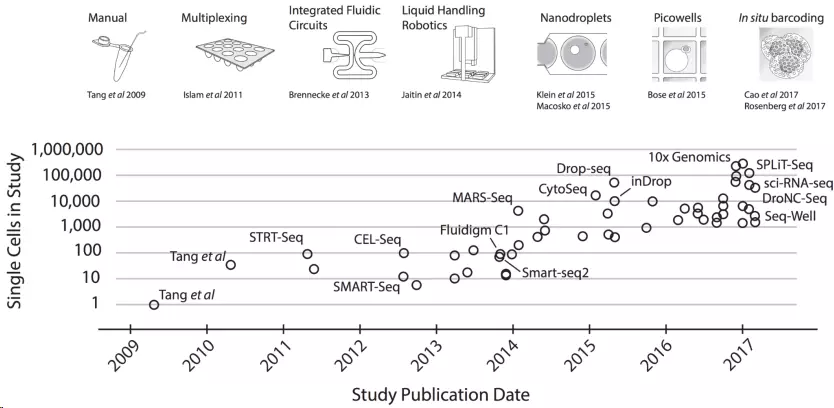
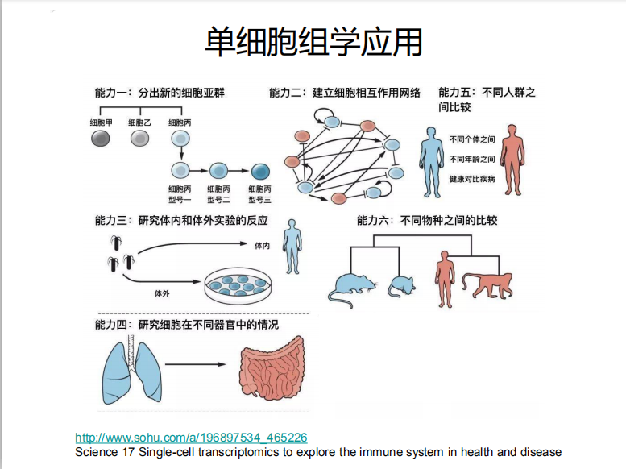
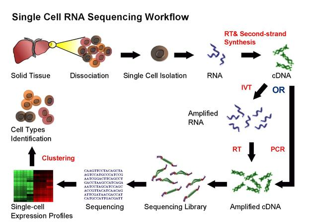
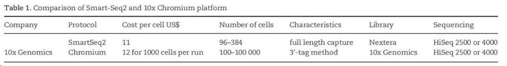
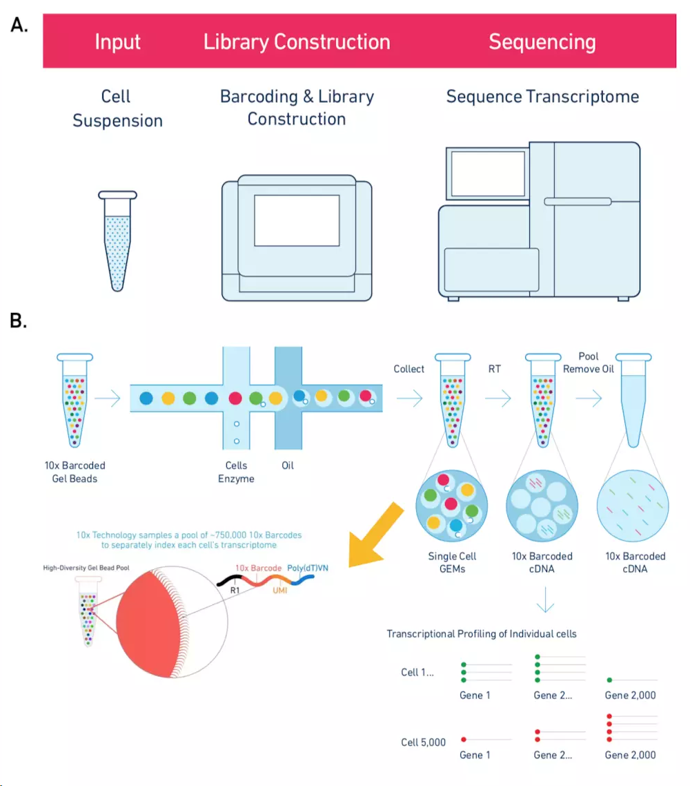
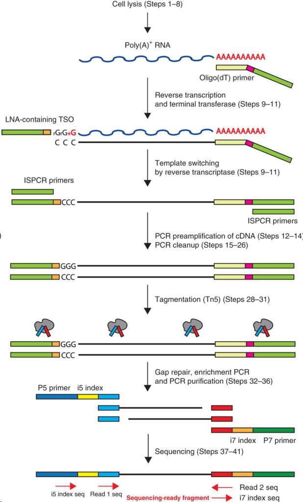
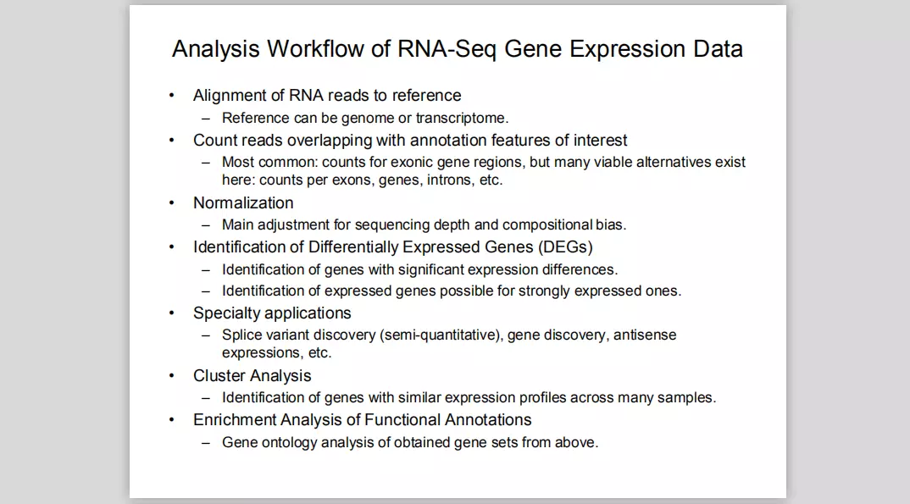

# Basic knowlege in scRNA-seq
Author:Rongting Huang

build date:2019-10-09

update date:

## Background

Every cell is unique—it occupies an exclusive position in space, carries distinct errors in its copied genome and is subject to programmed and induced changes in gene expression. Yet most DNA and RNA sequencing is performed on tissue samples or cell populations, in which biological differences between cells can be obscured by averaging or mistaken for technical noise.
--Nature method

Science_Oct 2017

Nature July 2017

Cell Oct 2012
### Brief introduction

那么，为什么要使用单细胞测序？

单细胞基因组测序通过在单个细胞水平上进行测序，解决了用组织样本无法获得不同细胞间的异质性信息或样本量太少无法进行常规测序的难题，为科学家研究单个细胞的行为、机制等提供了新的方向。单细胞基因组测序主要包括四个步骤：单细胞分离→全基因组扩增→高通量测序→数据分析。其中，单细胞分离及全基因组扩增对最终结果的准确性起到了关键作用。另一种是提取RNA，构建转录本调查不同细胞转录水平的差异。

也就是**单细胞测序**分为：**单细胞全基因组测序和单细胞转录组测序**。

世界上没有两片相同的叶子。对于多细胞生物来说，在不同的发育阶段细胞与细胞之间是有差异的。当然了，这个差异可大可小。

比如说，受精卵从一个细胞开始分裂，并逐渐形成囊胚，最终发育成个体的时候，细胞与细胞之间的差异会越来越大：有的分化成神经元，有的分化成骨骼肌，**各自表达着不同的遗传信息**，承担着不同的生理功能。

又比如在肿瘤组织中，肿块中心的细胞，肿块周围的细胞，淋巴转移灶的细胞，以及远端转移的细胞，其基因组和转录组等遗传信息，是存在差异的。而这种差异，在临床上，可以决定该肿瘤对某种疗法是否有效。这就是所谓的**遗传信息的异质性**。

**理解单细胞水平的遗传信息异质性，为我们理解遗传、发育、疾病机理打开了新的大门。**

## Sequencing Workflow

现在有许多处理单细胞测序的流程，比如13年的SAMRT-seq2，12年的CELL-seq，15年的Drop-seq。有一些做单细胞的平台，包括Fluidigm C1、Wafergen ICELL8、10X Genomics Chromium。发展到现在常用的就是[SMART-seq2](https://www.nature.com/articles/nprot.2014.006)和[10XGenomics](https://www.10xgenomics.com/)流程。

### 10XGenomic

10X Genomics起源自Drop-Seq技术， 横向孔道逐个导入凝胶微珠Gel beads，第一个纵向道输入细胞。当凝胶微珠和细胞碰撞会被吸附在微珠上，然后通过微流控技术运送到第二个纵向通道（“油管”）。**这时就会形成一个个的油滴GEMs（一个油滴就是一个凝胶微珠，也就是一个单细胞）**，然后收集在EP管中。**每一个凝胶微珠都布满了不同的Barcode和UMI连接的序列**，然后再加上PolyT就形成了像“刺”一样的捕获抓手，随后细胞裂解，利用3'端 poly(A) 碱基互补特定抓取mRNA构建转录文库。据说可以7分钟内完成100~80,000个细胞的捕获。

### SMART-seq2

Picelli S1, Faridani OR1, Björklund AK2, Winberg G2, Sagasser S2, Sandberg R2. (2014) Full-length RNA-seq from single cells using Smart-seq2. Nat Protoc 9(1), 171-181

在Smart-Seq2方案中，人们在包含游离dNTP和带有通用5’ 锚定序列的oligo(dT)寡核苷酸的缓冲液中裂解单细胞。之后开展逆转录，这个反应也在cDNA的3’端添加2-5个无模板的C核苷酸。然后加入模板转换寡核苷酸（TSO），它携带了两个核糖鸟苷和一个修饰鸟苷，在3’端产生LNA，作为最后一个碱基。在第一链反应后，利用有限的循环扩增cDNA。然后通过Tagmentation，利用扩增出的cDNA快速有效地构建测序文库。

优点：

1. 使用低至50 pg的起始材料。
2. 不需要知道mRNA的序列。
3. 不再需要纯化步骤。
4. 转录本的覆盖度改善。
5. 高水平的可定位序列。

缺点：

1. 并非链特异的。
2. 只测序poly(A)+ RNA。

这些方案利用现成的试剂，让研究人员能够更低成本、更大规模地开展复杂的单细胞分析。它的组分和原理向大家公开，让研究人员可进一步对其进行改良。在此之后，许多单细胞测序的新成果涌现。

## Data Analysis

总体数据分析流程如下图所示，前面三步（黄色）对于任何高通量测序数据是通用的，紧随其后的四步（橙色）是要将传统RNA-Seq分析中已有的方法和新开发的方法结合起来解决scRNA-seq的技术差异问题，最后的部分（蓝色）是使用专门为scRNA-seq开发的方法来进行生物分析解读。

由于每个单细胞都是独特的，不可能开展重复实验并评估噪音。因此，必须采取一些质量控制手段，以确保数据的可靠性。专家建议，向每个细胞裂解液中加入已知序列和数量的合成mRNA，如外源RNA对照联盟（ERCC）开发的加标RNA。这些RNA的读数将提供样本间差异的信息。

- 过滤

- 归一化

- 聚类分析

- t-SNE降维分析

- 差异表达分析

- mark基因识别

- 富集分析

- 蛋白互作网络分析

- 单细胞多组学分析

  以上介绍的其实都是基于**高通量的单细胞转录组分析思路**，开创性的单细胞分析现在能够对**基因组、表观基因组、转录组、蛋白质组和代谢组**谱系进行分析。Cell旗下的Trends in Biotechnology早在2016年就综述了为同一的细胞提供复杂的谱系，将不同维度的分析组合成多组学分析的方法。单细胞多组学分析测量同一细胞内的细胞状态的不同方面的能力有望揭开细胞的基因组、表观基因、转录组、蛋白质组与代谢组之间的相关联系；可以揭示DNA甲基化、染色质于转录起始之间的复杂关系。同时这篇文章也给予单细胞多组学（单细胞系统生物学）极高的评价。一篇评论文章称：**单细胞系统生物学是一个令人兴奋的新领域**，关注单细胞作为生物学的核心将为基础科学提供见解，在生物技术和生物医学方法提供有效的应用机会。

  新的分析点：
  • 批次效应矫正
  • RNA velocity分析
  • 细胞间通信
  • 分析百万单细胞的软件

## Challege

- 测序

- 分析

- 成像技术

- 走向临床

  

## Method related

## Course or source list

[**Analysis of single cell RNA-seq data](https://scrnaseq-course.cog.sanger.ac.uk/website/index.html)

## Reference
[单细胞测序（scRNA-seq）通关||数据处理必知必会](https://www.jianshu.com/p/8cee8bd4ad6f)
