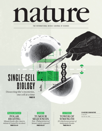
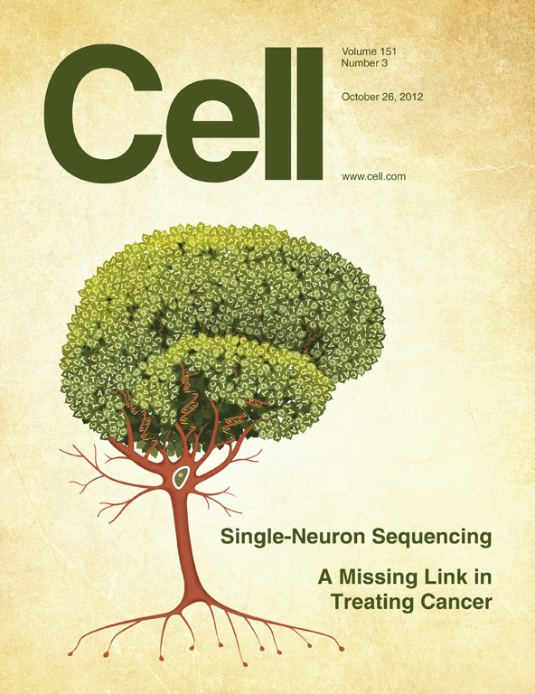

# Basic knowlege in scRNA-seq
Author:Rongting Huang

build date:2019-10-09

update date:

## Background

Every cell is unique—it occupies an exclusive position in space, carries distinct errors in its copied genome and is subject to programmed and induced changes in gene expression. Yet most DNA and RNA sequencing is performed on tissue samples or cell populations, in which biological differences between cells can be obscured by averaging or mistaken for technical noise.
--Nature method

## Course or source list

[**Analysis of single cell RNA-seq data](https://scrnaseq-course.cog.sanger.ac.uk/website/index.html)

