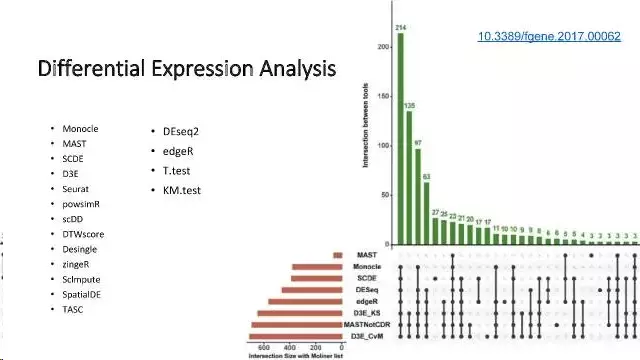

# Basic knowlege in scRNA-seq
Author:Rongting Huang

build date:2019-10-09

update date:

## Background

Every cell is unique—it occupies an exclusive position in space, carries distinct errors in its copied genome and is subject to programmed and induced changes in gene expression. Yet most DNA and RNA sequencing is performed on tissue samples or cell populations, in which biological differences between cells can be obscured by averaging or mistaken for technical noise.
--Nature method

Science_Oct 2017

Nature July 2017

Cell Oct 2012
### Brief introduction

那么，为什么要使用单细胞测序？

单细胞基因组测序通过在单个细胞水平上进行测序，解决了用组织样本无法获得不同细胞间的异质性信息或样本量太少无法进行常规测序的难题，为科学家研究单个细胞的行为、机制等提供了新的方向。单细胞基因组测序主要包括四个步骤：单细胞分离→全基因组扩增→高通量测序→数据分析。其中，单细胞分离及全基因组扩增对最终结果的准确性起到了关键作用。另一种是提取RNA，构建转录本调查不同细胞转录水平的差异。

也就是**单细胞测序**分为：**单细胞全基因组测序和单细胞转录组测序**。

世界上没有两片相同的叶子。对于多细胞生物来说，在不同的发育阶段细胞与细胞之间是有差异的。当然了，这个差异可大可小。

比如说，受精卵从一个细胞开始分裂，并逐渐形成囊胚，最终发育成个体的时候，细胞与细胞之间的差异会越来越大：有的分化成神经元，有的分化成骨骼肌，**各自表达着不同的遗传信息**，承担着不同的生理功能。

又比如在肿瘤组织中，肿块中心的细胞，肿块周围的细胞，淋巴转移灶的细胞，以及远端转移的细胞，其基因组和转录组等遗传信息，是存在差异的。而这种差异，在临床上，可以决定该肿瘤对某种疗法是否有效。这就是所谓的**遗传信息的异质性**。

**理解单细胞水平的遗传信息异质性，为我们理解遗传、发育、疾病机理打开了新的大门。**

## Sequencing Workflow

现在有许多处理单细胞测序的流程，比如13年的SAMRT-seq2，12年的CELL-seq，15年的Drop-seq。有一些做单细胞的平台，包括Fluidigm C1、Wafergen ICELL8、10X Genomics Chromium。发展到现在常用的就是[SMART-seq2](https://www.nature.com/articles/nprot.2014.006)和[10XGenomics](https://www.10xgenomics.com/)流程。

### 10XGenomic

10X Genomics起源自Drop-Seq技术， 横向孔道逐个导入凝胶微珠Gel beads，第一个纵向道输入细胞。当凝胶微珠和细胞碰撞会被吸附在微珠上，然后通过微流控技术运送到第二个纵向通道（“油管”）。**这时就会形成一个个的油滴GEMs（一个油滴就是一个凝胶微珠，也就是一个单细胞）**，然后收集在EP管中。**每一个凝胶微珠都布满了不同的Barcode和UMI连接的序列**，然后再加上PolyT就形成了像“刺”一样的捕获抓手，随后细胞裂解，利用3'端 poly(A) 碱基互补特定抓取mRNA构建转录文库。据说可以7分钟内完成100~80,000个细胞的捕获。

### SMART-seq2

Picelli S1, Faridani OR1, Björklund AK2, Winberg G2, Sagasser S2, Sandberg R2. (2014) Full-length RNA-seq from single cells using Smart-seq2. Nat Protoc 9(1), 171-181

在Smart-Seq2方案中，人们在包含游离dNTP和带有通用5’ 锚定序列的oligo(dT)寡核苷酸的缓冲液中裂解单细胞。之后开展逆转录，这个反应也在cDNA的3’端添加2-5个无模板的C核苷酸。然后加入模板转换寡核苷酸（TSO），它携带了两个核糖鸟苷和一个修饰鸟苷，在3’端产生LNA，作为最后一个碱基。在第一链反应后，利用有限的循环扩增cDNA。然后通过Tagmentation，利用扩增出的cDNA快速有效地构建测序文库。

优点：

1. 使用低至50 pg的起始材料。
2. 不需要知道mRNA的序列。
3. 不再需要纯化步骤。
4. 转录本的覆盖度改善。
5. 高水平的可定位序列。

缺点：

1. 并非链特异的。
2. 只测序poly(A)+ RNA。

这些方案利用现成的试剂，让研究人员能够更低成本、更大规模地开展复杂的单细胞分析。它的组分和原理向大家公开，让研究人员可进一步对其进行改良。在此之后，许多单细胞测序的新成果涌现。

## Data Analysis

总体数据分析流程如下图所示，前面三步（黄色）对于任何高通量测序数据是通用的，紧随其后的四步（橙色）是要将传统RNA-Seq分析中已有的方法和新开发的方法结合起来解决scRNA-seq的技术差异问题，最后的部分（蓝色）是使用专门为scRNA-seq开发的方法来进行生物分析解读。

由于每个单细胞都是独特的，不可能开展重复实验并评估噪音。因此，必须采取一些质量控制手段，以确保数据的可靠性。专家建议，向每个细胞裂解液中加入已知序列和数量的合成mRNA，如外源RNA对照联盟（ERCC）开发的加标RNA。这些RNA的读数将提供样本间差异的信息。

- 过滤

  根据基因的表达量等特征，对细胞进行过滤，通常的做法就是指定一个阈值，比如要求一个细胞中检测到的基因数必须大于100，才可以进入到下游分析，如果小于这个数字，就过滤掉该细胞。需要强调的是，在设定过滤的阈值时，需要人为判断，这样的设定方式会受到主观因素的干扰，**所以往往都会指定一个非常小的过滤范围，保证只过滤掉极少数的离群值点。**

- 归一化

  

- 聚类分析

  聚类分析用于**识别细胞亚型**（如细胞异质性、细胞分化周期的判定等），如在R包**Seurat**中，不是直接对所有细胞进行聚类分析，而是首先进行PCA主成分分析，然后挑选贡献量最大的几个主成分（**也相当于做了特征选择**），**用挑选出的主成分的值来进行聚类分析**。2019年的Nature Review上面发表了一篇文章来讨论单细胞测序数据聚类遇到的挑战，聚类分析是后续分析的起点，聚类方法的选择显得格外重要，同时也是对已有聚类算法的挑战。

  常用的有图聚类和k-means聚类算法。

- t-SNE降维分析

  

  多维空间的概念

  t-SNE是目前来说效果最好的**数据降维与可视化方法**，但是它的缺点也很明显，比如：占内存大，运行时间长。但是，当我们想要对高维数据进行分类，又不清楚这个数据集有没有很好的可分性（即同类之间间隔小，异类之间间隔大），**可以通过t-SNE投影到2维或者3维的空间中观察一下**。如果在低维空间中具有可分性，则数据是可分的；如果在低维空间中不具有可分性，可能是数据不可分，也可能仅仅是因为不能投影到低维空间。

  

- 差异表达分析

  **细胞很多，每个细胞的基因也有很多**，那么**哪些基因才是有意义的呢**？需要一些统计手段来把这些基因识别出来，这就是差异表达分析，针对单细胞测序（特别是scRNA-seq）数据的特点，已经开发的算法和软件见下图：

  

- mark基因识别

  通过差异分析来识别**每个cluster下的标记基因**，将该cluster下的细胞作为一组，其他cluster下的细胞作为另一组，然后进行差异分析

- 富集分析

  一般提到富集分析，首先想到的就是**GO、KEGG**这两把刷子，然后还需要知道两个重要概念：前景基因、背景基因

  **前景基因**：你关注的要重点研究的基因集；
  **背景基因**：所有的基因集
  比如做转录组测序，一般都要设置处理组和对照组，前景基因是处理和对照的差异基因，背景基因就是两组样本的全部表达基因。

  另外还有一种是Gene Set Enrichment Analysis 基因集富集分析，用于评估一个基因集的基因在表型相关度排序中的分布趋势，进而判断它们对表型的贡献。

- 蛋白互作网络分析

  蛋白互作网络（protein protein interaction network，PPI network）分析有助于从系统的角度研究疾病分子机制、发现新药靶点等等。一个常用的PPI数据库是STRING数据库。STRING数据库是一个搜索已知蛋白质之间和预测蛋白质之间相互作用的数据库，该数据库可应用于2031个物种，~~包含960万种蛋白和1380万种~~蛋白质之间的相互作用。**蛋白质之间的相互作用包括了直接的物理相互作用和间接的功能相关性**。

- 单细胞多组学分析

  以上介绍的其实都是基于**高通量的单细胞转录组分析思路**，开创性的单细胞分析现在能够对**基因组、表观基因组、转录组、蛋白质组和代谢组**谱系进行分析。Cell旗下的Trends in Biotechnology早在2016年就综述了为同一的细胞提供复杂的谱系，将不同维度的分析组合成多组学分析的方法。单细胞多组学分析测量同一细胞内的细胞状态的不同方面的能力有望揭开细胞的基因组、表观基因、转录组、蛋白质组与代谢组之间的相关联系；可以揭示DNA甲基化、染色质于转录起始之间的复杂关系。同时这篇文章也给予单细胞多组学（单细胞系统生物学）极高的评价。一篇评论文章称：**单细胞系统生物学是一个令人兴奋的新领域**，关注单细胞作为生物学的核心将为基础科学提供见解，在生物技术和生物医学方法提供有效的应用机会。

  新的分析点：
  • 批次效应矫正
  • RNA velocity分析
  • 细胞间通信
  • 分析百万单细胞的软件

## Challege

- 测序

  比较不同细胞（不同测序文库）的结果需要格外注意。文库之间差异的主要来源是：

  1. 扩增效率和扩增偏好性（部分文库可扩增多达100万倍）
  2. 基因 **‘dropouts’**: 基因在一个细胞中呈现中等表达水平,但在另一个细胞中未检测到表达，这可能来源于scRNA-seq中RNA总量低导致的扩增建库丢失或RNA表达的随机性。

  取自于单独一个细胞的低转录本总量是这两个文库差异的一个主要原因。提高转录本捕获效率和降低扩增偏好可以降低差异，是目前活跃的研究方向。从后续课程学习中也可以看到，**合适的标准化和校正方法也可以抵消一部分文库构建引入的噪音**。

- 分析

  本身高通量测序数据给传统的数据分析（主要是统计学）就带来了挑战，如高纬度、非正态、高噪声等。单细胞带着这些特点加上其较高的通量（一次可测10e6个细胞)、多个数据库的注释结果等特点，使得单细胞测序数据的分析对数学知识和计算机资源有着更高的要求。

- 成像技术

  当前，光学显微镜，尤其是荧光显微镜仍然被许多生物学家经常使用。然而作者们认为传统的光学显微镜有一个主要的局限：由于受到衍射现象的影响，无法解析距离小于半个光波的物体。无论使用多高的放大倍数，衍射均使得成像看起来模糊，相互重叠。

  尽管在过去的几年里，超分辨率显微镜领域取得了大量的成果，空间分辨率不断提高，然而由于需要高时间分辨率活细胞成像仍是一个挑战。

- 走向临床

  除了技术，主要表现在操作规范以及法律法规上。

  

## Term

- **spike-in control**是常用的评估技术差异的方法, Lun et al.的研究发现spike-in control 在确定测序过程中的empty Wells和的dead cells有重要作用，因为高的ERCC含量与低质量数据相关，并且通常是排除的标准。
  Spike-in：A molecule or a set of molecules introduced to the sample in order to calibrate measurements and account for technical variation; commonly used examples include external RNA control consortium (ERCC) controls (Ambion/Thermo Fisher Scientific) and Spike-in RNA variant control mixes。**一个分子或一组分子引入到样品中以校准测量并解释技术变化**；常用的例子包括外部RNA控制联合体（Ercc）和spike-in RNA变体控制混合物。
- **nGene**代表的是在该细胞中共检测到的表达量大于0的基因个数，**nUMI**代表的是该细胞中所有基因的表达量之和，mito.percent代表的是线粒体基因表达量的百分比，一般通过小提琴图来展示对应的分布。

## Method related

## Course or source list

[**Analysis of single cell RNA-seq data](https://scrnaseq-course.cog.sanger.ac.uk/website/index.html)

## Reference
[单细胞测序（scRNA-seq）通关||数据处理必知必会](https://www.jianshu.com/p/8cee8bd4ad6f)
